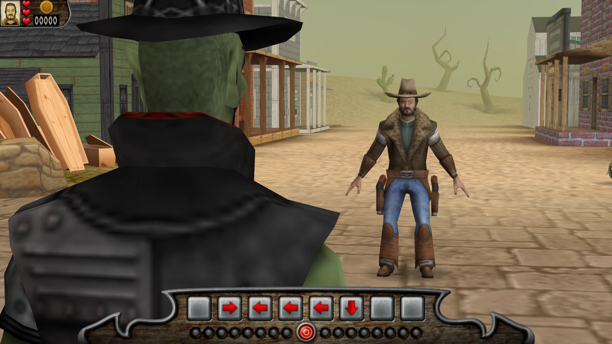

# Billy Frontier

This is a port of Pangea Software’s “cowboys in space” game **Billy Frontier** to modern operating systems.

**Download the game for macOS, Windows and Linux here:** https://github.com/jorio/BillyFrontier/releases

## About Billy Frontier

Billy Frontier is an arcade style action game with a “cowboys in space” theme. You get to fight in duels, shootouts and stampedes. It’s the kind of game you’ll want to pick up and play whenever you get that twitch to just shoot something and blow stuff up!

Billy Frontier was released for PowerPC Macs in 2003. This is a port of the game to modern operating systems.

### Controls

Shootout controls:
- **Shoot**: Left Mouse Button
- **Duck**: Right Mouse Button or `Ctrl` key
- **Turn**: either...
    - ...slam the cursor to the edge of the screen,
    - ...scroll the mouse wheel,
    - ...scroll horizontally on a trackpad, 
    - ...or, press the `A`/`D` or left/right keys.
- **Proceed** once all baddies are out: Middle Mouse Button or `⌘` key (Mac) or `Alt` key (Windows/Linux)

Stampede controls:
- **Turn**: `A`/`D` or left/right keys
- **Jump**: `Spacebar`

Duel controls:
- Match the reflex sequence using the arrow keys.
- To skip a duel, press `⌘`+`F10` (Mac) or `⊞`+`F10` (Windows/Linux)

### More documentation

- [Original instruction manual](Instructions.pdf)
- [BUILD](BUILD.md) – How to build the game from source
- [CHANGELOG](CHANGELOG.md) – Billy Frontier version history
- [LICENSE](LICENSE.md) – Licensing info (see also below)

### Legal info

Billy Frontier © 2003 Pangea Software, Inc. Billy Frontier is a trademark of Pangea Software, Inc. This version was made and re-released here (https://github.com/jorio/BillyFrontier) under permission from Pangea Software, Inc.

This version is licensed under [CC-BY-NC SA 4.0](LICENSE.md).

## More Pangea stuff!

Check out my ports of [Bugdom](https://github.com/jorio/Bugdom), [Cro-Mag Rally](https://github.com/jorio/CroMagRally), [Mighty Mike (Power Pete)](https://github.com/jorio/MightyMike), [Nanosaur](https://github.com/jorio/Nanosaur), and [Otto Matic](https://github.com/jorio/OttoMatic).

All ports are free of charge! If you’d like to support the development of Pangea game ports, feel free to visit https://jorio.itch.io and name your own price for any of the games there. Much appreciated! 😊
